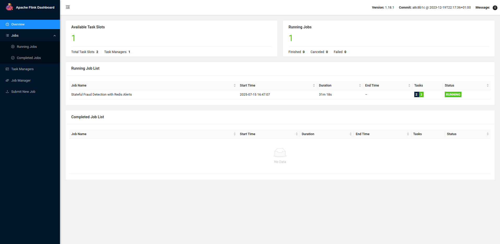
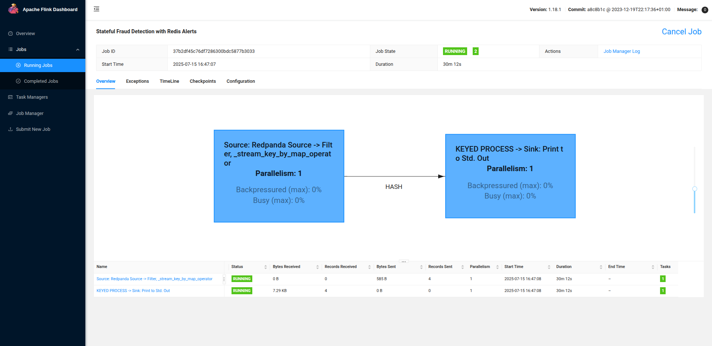
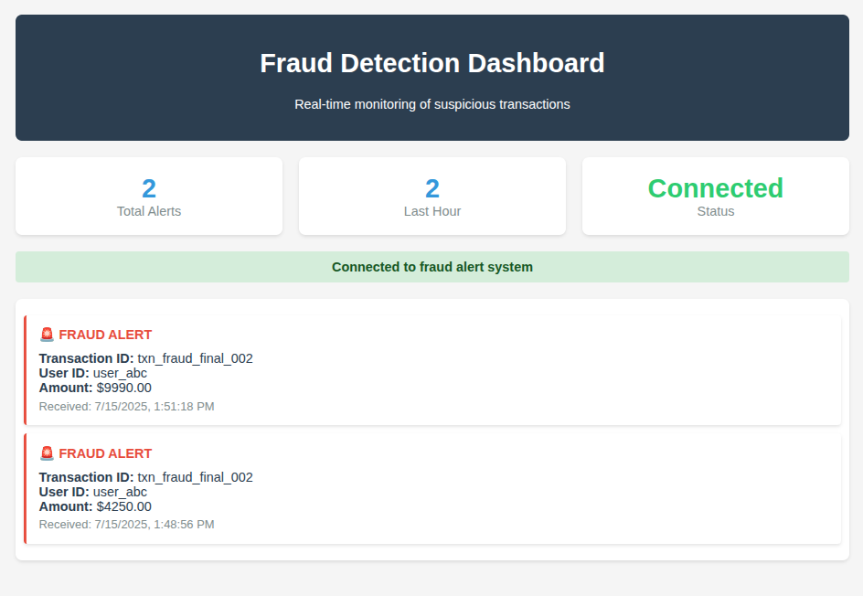
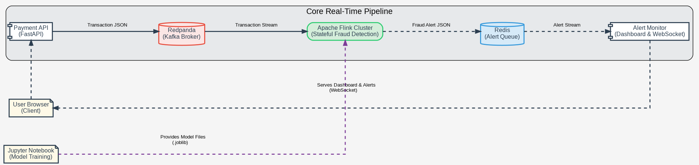

# Real-Time Fraud Detection System

This project demonstrates a complete, end-to-end real-time fraud detection system built with a modern streaming data stack. It simulates a stream of financial transactions, processes them using a stateful machine learning model in Apache Flink, and displays detected fraudulent activity on a live dashboard.

The primary goal is to showcase a realistic, distributed architecture for stateful stream processing, anomaly detection, and real-time alerting.

---

## System in Action

<div
  style="display: flex; flex-direction: column; align-items: center; gap: 16px;"
>
  
  <p>
    <strong>Flink Job Overview:</strong> Displays the active Flink job titled
    "Stateful Fraud Detection with Redis Alerts" in a stable
    <code>RUNNING</code> state, indicating continuous stream processing.
  </p>



  <p>
    <strong>Flink Job Details (Dataflow):</strong> Visualizes the internal
    operators and data transformation steps within the Flink pipeline, including
    source, keyed processing, model inference, and sink stages.
  </p>



  <p>
    <strong>Fraud Detection Dashboard:</strong> The web interface for real-time
    monitoring of fraud alerts. It connects to the backend via WebSocket and
    displays incoming fraud events as they are detected.
  </p>
</div>

- **Flink UI (Top):** Shows the "Stateful Fraud Detection with Redis Alerts" job in a stable `RUNNING` state, processing data as it arrives.
- **Fraud Dashboard (Bottom):** The end-user interface displays alerts in real-time as they are detected.

---

## System Architecture



The system is composed of several microservices orchestrated by Docker Compose. The data flows through the pipeline as follows:

1.  **Payment API**: A Python FastAPI application that acts as a simple payment gateway, receiving transaction data via a POST request.
2.  **Redpanda**: A high-performance, Kafka-compatible streaming data platform that receives transactions from the API and stores them in the `transactions` topic.
3.  **Apache Flink Application**: A stateful PyFlink job that consumes transactions from Redpanda. For each user, it maintains historical features (e.g., average transaction amount) and uses a pre-trained Isolation Forest model to classify each new transaction as fraudulent or legitimate.
4.  **Redis**: A fast, in-memory message queue. When Flink detects a fraudulent transaction, it pushes a JSON alert message into a Redis list.
5.  **Alert Monitor**: A second Python FastAPI application that serves a web dashboard. It uses a WebSocket to listen for new alerts from the Redis queue and displays them to the user in real-time.

---

## Core Components

### 1. Payment API (`/payment_api`)

- **Technology**: Python, FastAPI, Uvicorn, `kafka-python`.
- **Role**: Provides a `/transaction` endpoint to ingest data into the system. It validates the incoming data and produces it as a JSON message to the `transactions` topic in Redpanda.

### 2. Flink Application (`/flink_app`)

- **Technology**: PyFlink, `scikit-learn`, `joblib`.
- **Role**: The core processing engine. The `fraud_detector.py` script consumes from Kafka, keys the stream by `user_id`, maintains user state, and applies the trained ML model to detect anomalies.
- **Model**: Contains the serialized `isolation_forest.joblib` and `scaler.joblib` files required for inference.

### 3. Alert Monitor (`/alert_monitor`)

- **Technology**: Python, FastAPI, Uvicorn, WebSockets, `redis-py`.
- **Role**: Provides the user interface. Serves an HTML dashboard and establishes a WebSocket connection with the user's browser. A background task listens to the Redis queue and broadcasts any new alerts to all connected clients.

### 4. Data & Model Generation (`/notebooks`)

- **Technology**: Jupyter, Pandas, Scikit-learn.
- **Role**: The `1-data_generation_and_training.ipynb` notebook is used for the offline portion: generating a synthetic dataset of transactions and training the Isolation Forest model. **Crucially, this is where the model files used by the Flink app are created.**

---

## Technology Stack

- **Stream Processing**: Apache Flink 1.18.1
- **Message Broker**: Redpanda (Kafka-compatible)
- **Alerting Queue**: Redis
- **Web APIs/Services**: Python 3.10, FastAPI, Uvicorn
- **Machine Learning**: Scikit-learn, Joblib, Pandas, Numpy
- **Orchestration**: Docker & Docker Compose

---

## Getting Started

Follow these steps to build and run the entire system on your local machine.

### Prerequisites

- Docker
- Docker Compose

### 1. Environment Setup & Model Generation

This is the most critical step to ensure the ML model is compatible with the Flink environment.

1.  **Navigate to the notebooks directory:**

    ```bash
    cd notebooks
    ```

2.  **Create and activate a Python virtual environment:**

    ```bash
    python3 -m venv venv
    source venv/bin/activate
    ```

3.  **Install pinned dependencies:**
    This installs the exact library versions used in the Flink cluster.

    ```bash
    pip install -r requirements.txt
    ```

4.  **Run the Jupyter Notebook:**
    Start Jupyter Lab/Notebook and open `1-data_generation_and_training.ipynb`. **Run all cells from top to bottom.** This will create/overwrite two essential files with the correct versions:
    - `../flink_app/model/isolation_forest.joblib`
    - `../flink_app/model/scaler.joblib`

### 2. Build and Launch the System

1.  **Navigate back to the project root directory.**
2.  **Stop any old containers and remove old volumes** to ensure a clean start.
    ```bash
    docker compose down --volumes
    ```
3.  **Build all the service images:**
    ```bash
    docker compose up -d --build
    ```
    This will take a few minutes the first time. The command will wait until the `redis` service is healthy before starting the `alert-monitor`.

### 3. Submit the Flink Job

1.  Wait about **30 seconds** for all services to fully initialize.
2.  Execute the `flink run` command to submit the Python script to the cluster:
    ```bash
    docker compose exec flink-jobmanager flink run -py /opt/flink/usrlib/fraud_detector.py
    ```
3.  You will see a success message: `Job has been submitted with JobID ...`

---

## How to Test

Your real-time fraud detection system is now running!

1.  **Open the Dashboards:**

    - **Flink UI:** Navigate to `http://localhost:8081`. Click on "Running Jobs" to see your "Stateful Fraud Detection with Redis Alerts" job in a stable, green **RUNNING** state.
    - **Alert Dashboard:** Navigate to `http://localhost:8080`. The page should load and the status should say **"Connected to fraud alert system"**.

2.  **Send a Normal Transaction:**
    This first transaction establishes a baseline history for a new user. It should **not** trigger an alert.

    ```bash
    curl -X POST "http://localhost:8000/transaction" \
    -H "Content-Type: application/json" \
    -d '{
        "transaction_id": "txn_normal_001",
        "user_id": "user-test-123",
        "card_number": "4242-4242-4242-4242",
        "amount": 50.00,
        "timestamp": "2025-07-15T10:00:00Z",
        "merchant_id": "merchant_a",
        "location": "New York"
    }'
    ```

3.  **Send a Fraudulent Transaction:**
    This second transaction for the same user has a very high amount and will be flagged as an anomaly by the model.

    ```bash
    curl -X POST "http://localhost:8000/transaction" \
    -H "Content-Type: application/json" \
    -d '{
        "transaction_id": "txn_fraud_002",
        "user_id": "user-test-123",
        "card_number": "4242-4242-4242-4242",
        "amount": 5000.00,
        "timestamp": "2025-07-15T10:01:00Z",
        "merchant_id": "merchant_b",
        "location": "Online"
    }'
    ```

4.  **Observe the Result:**
    Look at the dashboard at `http://localhost:8080`. A red "FRAUD ALERT" card for transaction `txn_fraud_002` will appear instantly.

### Shutdown

To stop all services and remove all containers, networks, and data volumes, run:

```bash
docker compose down --volumes
```
